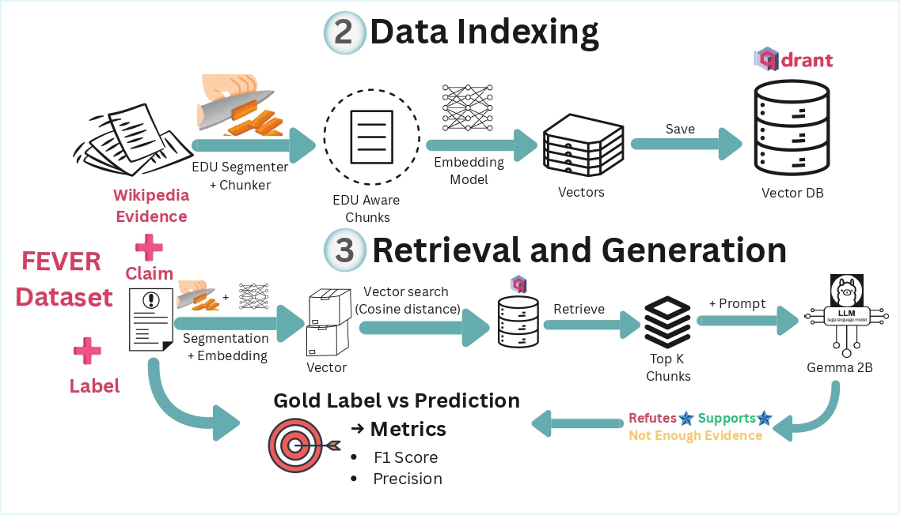

# EDU-Chunking-RAG
Enhancing RAG retrieval with discourse-segmented chunks instead of fixed-length tokens for factual verification




## 📋 Prerequisites
- **Python 3.10+**
- **Git**
- **pip** (Python package manager)
- **[`Ollama`](https://ollama.com/)** (To run models locally)

Optional but recommended:
- **GPU with CUDA** for faster training
- A [Weights & Biases (W&B)](https://wandb.ai/site) account for run tracking
- [`uv`](https://github.com/astral-sh/uv) is a fast Python package and environment manager.
    ```bash
    pip install uv
    ````
---
## ⚙️ Steps to Follow
### 1. Download/ Clone the repository

```bash 
git clone https://github.com/vighneshk05/EDU-Chunked-RAG-Fact-Checker.git
```


### 2. Create and activate a new environment

```bash

uv venv .venv
source .venv/bin/activate   # macOS / Linux
```

#### OR
```bash

.venv\Scripts\activate      # Windows
````

### 3. Install the Project Dependencies
Make sure you run these commands from from folder with pyproject.toml file
```bash

uv pip install -e .
````

### 4. Dataset download and verification
Visit the official FEVER dataset page: **https://fever.ai/dataset/fever.html**

Download the following files and place them in dataset folder in root project directory:
- **Paper Development Dataset** (`paper_dev.jsonl`)
- **Paper Test Dataset** (`paper_test.jsonl`)
- **Training Dataset** (`train.jsonl`)
- **Pre-processed Wikipedia Pages** (June 2017 dump) - Multiple `.jsonl` files in a zip archive

### Dataset Structure

After downloading, organize your files as follows:

```
dataset/
├── train.jsonl                    # Training claims
├── paper_dev.jsonl               # Development/validation claims
├── paper_test.jsonl              # Test claims
└── wiki-pages/
    └── wiki-pages/
        ├── wiki-001.jsonl
        ├── wiki-002.jsonl
        ├── wiki-003.jsonl
        └── ... (109 files total)
```

### Dataset Reduction (Optional but Recommended)

⚠️ **Important for Limited Compute**: The full FEVER dataset is very large:
- Training: ~145,000 claims
- Wikipedia: ~5.4 million documents
- Total size: ~10+ GB

If you have **limited compute resources or no GPU access**, use the dataset reducer to create a smaller, manageable subset while maintaining class balance.

### Configure and Run the Reducer

**Edit the script** (`com/fever/data/dataset_reducer.py`):
   ```python
   # Adjust BASE_DIR to match your setup
   BASE_DIR = "../../../../dataset/"  # Or "./dataset/" if in project root
   
   # Configure your desired sizes
   reducer = FEVERDatasetReducer(
       train_size=10000,        # Reduce from 145k (adjust as needed)
       dev_size=2000,           # Reduce from 19k
       test_size=2000,          # Reduce from 19k
       output_dir=BASE_DIR + "reduced_fever_data",
       random_seed=42,
       additional_random_docs=50000  # Random Wikipedia distractor docs
   )
   ```
   
**Run the reducer**:
   ```bash
   python -m com.fever.data.dataset_reducer
   ```

### What the Reducer Does

✅ **Maintains class balance** - Preserves the original distribution of SUPPORTS/REFUTES/NOT ENOUGH INFO

✅ **Filters relevant evidence** - Only keeps Wikipedia documents referenced in the claims

✅ **Adds distractor documents** - Includes random Wikipedia pages to make retrieval challenging

✅ **Creates new dataset structure**:
```
dataset/
└── reduced_fever_data/
    ├── train.jsonl              # 10,000 claims (balanced)
    ├── paper_dev.jsonl          # 2,000 claims (balanced)
    ├── paper_test.jsonl         # 2,000 claims (balanced)
    └── wiki/
        └── filtered_evidence.jsonl  # ~50k-60k relevant documents
```

### Recommended Sizes by Compute Availability

| Compute Setup | Train | Dev | Test | Random Docs | Total Wiki Docs |
|--------------|-------|-----|------|-------------|-----------------|
| **No GPU / Limited RAM** | 5,000 | 1,000 | 1,000 | 20,000 | ~25k |
| **Google Colab Free** | 10,000 | 2,000 | 2,000 | 50,000 | ~55k |
| **Single GPU (8GB+)** | 20,000 | 5,000 | 5,000 | 100,000 | ~110k |
| **Full Dataset** | 145,449 | 19,998 | 19,998 | N/A | 5.4M |

### Update Paths in the Code

If using the reduced dataset, update paths in your training scripts:

```python
# In your training/evaluation scripts:

# Option 1: Use full dataset
WIKI_DIR = "dataset/wiki-pages/wiki-pages"
DEV_FILE = "dataset/paper_dev.jsonl"

# Option 2: Use reduced dataset
WIKI_DIR = "dataset/reduced_fever_data/wiki"
DEV_FILE = "dataset/reduced_fever_data/paper_dev.jsonl"
```


## 4.5 EDU Model Setup (Required for Custom EDU Chunking)
### Overview
The custom_edu chunker uses a trained neural model to segment text into Elementary Discourse Units (EDUs) - semantically meaningful chunks that preserve discourse structure. This typically provides better retrieval performance than fixed-length chunking strategies.
### Training Your EDU Segmentation Model
The EDU segmentation model must be trained separately using the DISRPT-Segmenter repository:

📦 Repository: https://github.com/vighneshk05/EDU-Segmenter

After training, copy th ebest model path folder to the desired location as shown below:
```
EDU-Chunking-RAG/
├── dataset/
│   └── reduced_fever_data/
├── edu_segmenter_linear/          # EDU model directory
│   └── best_model/                # Trained model files
│       ├── config.json
│       ├── pytorch_model.bin
│       ├── tokenizer_config.json
│       ├── vocab.txt
│       └── ... (other model files)
├── com/
│   └── fever/
│       └── rag/
│           └── retriever/
└── requirements.txt
```

## 5. Run Retrieval Evaluator

Run baseline evaluation: `python -m com.fever.rag.retre.fever_classifier`

### Basic Usage
``` bash
python retriever_evaluator.py \
    --chunker_type custom_edu \
    --model_path path/to/edu_model \
    --wiki_dir path/to/wiki \
    --claim_file_path path/to/claims.jsonl
```

### Full Example with All Parameters

``` bash
python retriever_evaluator.py \
    --qdrant_host localhost \
    --qdrant_port 6333 \
    --qdrant_in_memory False \
    --embedding_model_name sentence-transformers/all-MiniLM-L6-v2 \
    --chunking_overlap 2 \
    --chunk_size 500 \
    --max_tokens 128 \
    --k_retrieval 1 3 5 10 20 \
    --wiki_dir ../../../../dataset/reduced_fever_data/wiki \
    --output_file ../../../retrieval_evaluation_results.jsonl \
    --model_path ../../../../edu_segmenter_linear/best_model \
    --claim_file_path ../../../../dataset/reduced_fever_data/paper_dev.jsonl \
    --chunker_type custom_edu \
    --retrieval_strategy top_k \
    --top_k 20 \
    --threshold 0.5 
```

# Retriever Evaluation Tool

This tool evaluates different chunking strategies and retrieval configurations for the FEVER fact verification task using vector databases.

## Overview

The evaluation pipeline:
1. Chunks Wikipedia articles using specified strategy
2. Builds a vector database with embeddings
3. Retrieves relevant documents for FEVER claims
4. Evaluates performance using precision, recall, accuracy, and MRR metrics

## Installation

```bash
pip install -r requirements.txt
```

Required dependencies:
- transformers
- qdrant-client
- sentence-transformers
- torch
- tqdm

## Usage

### Basic Usage

```bash
python com/fever/rag/retriever/retriever_evaluator.py \
    --chunker_type custom_edu \
    --model_path path/to/edu_model \
    --wiki_dir path/to/wiki \
    --claim_file_path path/to/claims.jsonl
```

### Full Example with All Parameters

```bash
python com/fever/rag/retriever/retriever_evaluator.py \
    --qdrant_host localhost \
    --qdrant_port 6333 \
    --qdrant_in_memory False \
    --embedding_model_name sentence-transformers/all-MiniLM-L6-v2 \
    --chunking_overlap 2 \
    --chunk_size 500 \
    --max_tokens 128 \
    --k_retrieval 1 3 5 10 20 \
    --wiki_dir dataset/reduced_fever_data/wiki \
    --output_file retrieval_evaluation_results.jsonl \
    --model_path edu_segmenter_linear/best_model \
    --claim_file_path dataset/reduced_fever_data/paper_dev.jsonl \
    --chunker_type custom_edu \
    --retrieval_strategy top_k \
    --top_k 20 \
    --threshold 0.5
```

### Parameters

#### Database Configuration

| Parameter | Type | Default | Description |
|-----------|------|---------|-------------|
| `--qdrant_host` | str | `localhost` | Qdrant vector database host address |
| `--qdrant_port` | int | `6333` | Qdrant vector database port number |
| `--qdrant_in_memory` | bool | `False` | Use in-memory Qdrant instance (True) or persistent storage (False) |

#### Chunking Configuration

| Parameter | Type | Default | Description |
|-----------|------|---------|-------------|
| `--chunker_type` | enum | `custom_edu` | Chunking strategy to use. Options: `custom_edu`, `fixed_char`, `fixed_token`, `sentence` |
| `--chunking_overlap` | int | `0` | Number of overlapping units between chunks (sentences/tokens/chars depending on chunker) |
| `--chunk_size` | int | `500` | Fixed character size per chunk (only for `fixed_char` chunker) |
| `--max_tokens` | int | `128` | Maximum tokens per chunk (only for `fixed_token` chunker) |
| `--model_path` | str | - | **Required for custom_edu**: Path to trained EDU segmentation model directory |

#### Embedding Configuration

| Parameter | Type | Default | Description |
|-----------|------|---------|-------------|
| `--embedding_model_name` | str | `sentence-transformers/all-MiniLM-L6-v2` | HuggingFace embedding model name. Popular options:<br>- `sentence-transformers/all-MiniLM-L6-v2` (fast, 384 dims)<br>- `sentence-transformers/all-mpnet-base-v2` (best quality, 768 dims)<br>- `sentence-transformers/multi-qa-mpnet-base-dot-v1` (optimized for Q&A) |

#### Retrieval Configuration

| Parameter | Type | Default | Description |
|-----------|------|---------|-------------|
| `--retrieval_strategy` | enum | `top_k` | Retrieval strategy. Options:<br>- `top_k`: Retrieve top K documents<br>- `threshold`: Retrieve all documents above similarity threshold |
| `--top_k` | int | `5` | Number of top documents to retrieve (only used with `top_k` strategy) |
| `--threshold` | float | `0.5` | Minimum similarity score for retrieval (only used with `threshold` strategy) |
| `--k_retrieval` | int[] | `[1,3,5,10,20]` | List of K values to evaluate metrics at (e.g., Precision@5, Recall@10) |

#### Data Paths

| Parameter | Type | Default | Description |
|-----------|------|---------|-------------|
| `--wiki_dir` | str | `dataset/reduced_fever_data/wiki` | Directory containing Wikipedia articles in JSONL format |
| `--claim_file_path` | str | `dataset/reduced_fever_data/paper_dev.jsonl` | Path to FEVER claims dataset (JSONL format) |
| `--output_file` | str | `retrieval_evaluation_results.jsonl` | Output file path for evaluation results (appends to existing file) |

### Chunker Types Explained

#### 1. `custom_edu` (Elementary Discourse Units)
Uses a trained neural model to segment text into semantically meaningful EDU chunks.

**Required parameters:**
- `--model_path`: Path to trained EDU segmentation model

**Example:**
```bash
--chunker_type custom_edu \
--model_path ./edu_model/best_model \
--chunking_overlap 2
```

#### 2. `fixed_char` (Fixed Character Length)
Splits text into chunks of fixed character length.

**Required parameters:**
- `--chunk_size`: Number of characters per chunk

**Example:**
```bash
--chunker_type fixed_char \
--chunk_size 500 \
--chunking_overlap 50
```

#### 3. `fixed_token` (Fixed Token Length)
Splits text into chunks of fixed token length.

**Required parameters:**
- `--max_tokens`: Number of tokens per chunk

**Example:**
```bash
--chunker_type fixed_token \
--max_tokens 128 \
--chunking_overlap 20
```

#### 4. `sentence` (Sentence-Based)
Chunks text by sentences using linguistic boundaries.

**Example:**
```bash
--chunker_type sentence \
--chunking_overlap 1
```

### Retrieval Strategies

#### Top-K Strategy
Retrieves exactly K most similar documents regardless of similarity score.

```bash
--retrieval_strategy top_k \
--top_k 10
```

#### Threshold Strategy
Retrieves all documents with similarity score above the threshold.

```bash
--retrieval_strategy threshold \
--threshold 0.7
```

### Output Format
Results are appended to the output file in JSONL format

#### Evaluation Metrics
- **Precision@K**: Proportion of retrieved documents that are relevant
- **Recall@K**: Proportion of relevant documents that are retrieved
- **Accuracy@K**: Whether at least one relevant document appears in top-K
- **Mean Reciprocal Rank (MRR)**: Average of 1/rank for the first relevant document

## 6. Test the pipeline end to end With LLM (generator)

### Installation
```bash 
brew install ollama
```

### Run ollama server
```bash
ollama serve
```
### Pull your favorite LLM
```bash
ollama pull gemma:2b
```
 
### 🚀 Running the Full RAG Pipeline

Before running the full FEVER RAG pipeline, you must use the optimized retrieval parameters you discovered during the retrieval experiments (e.g., best chunker, best top-k or threshold, best embedding model, etc.).

Once you know the best retrieval configuration, you can run the full pipeline by adding the following additional parameters related to classification and LLM generation:
```bash
python -m com/fever/rag/runner.py \
    --llm_name gemma:2b \
    --few_shot_examples 2 \
    --temperature 0.7 \
    --max_evidence_chunks 0.9
```

| Parameter                   | Example | Meaning                                                                                                      | When to Use                                                                       |
| --------------------------- | --- |--------------------------------------------------------------------------------------------------------------| --------------------------------------------------------------------------------- |
| **`--llm_name`**            | `gemma:2b` | Specifies which LLM (via Ollama) will classify FEVER claims using the retrieved evidence.                    | Choose a model based on speed vs. accuracy trade-off.                             |
| **`--few_shot_examples`**   | `2` | Number of labelled FEVER examples (per class) included in the prompt for few-shot learning. `0` = zero-shot. | Use 1–5 for better accuracy if latency is acceptable.                             |
| **`--temperature`**         | `0.7` | Controls output randomness. Lower values = deterministic; higher = more varied.                              | FEVER usually benefits from **0.0–0.3** for stable labels.                        |
| **`--max_evidence_chunks`** | `5` | Maximum number of retrieved chunks given to the LLM as evidence. Can be integer.                             | Increase if retrieval returns useful evidence; decrease for faster LLM inference. |
